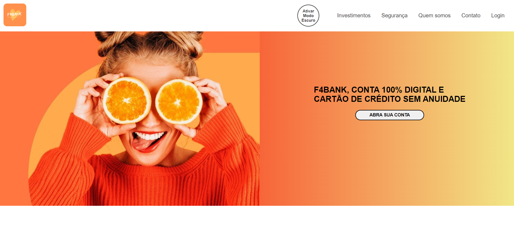
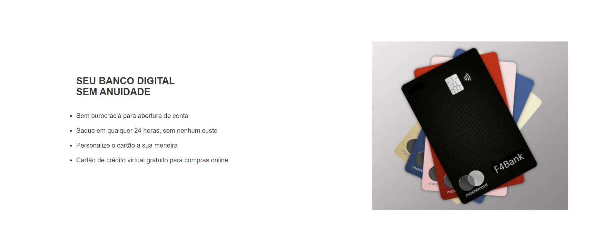
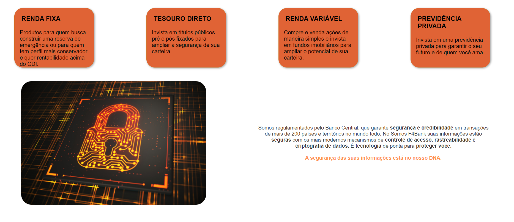
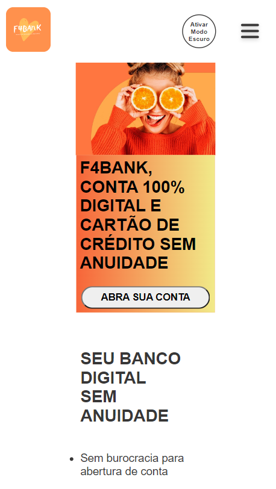
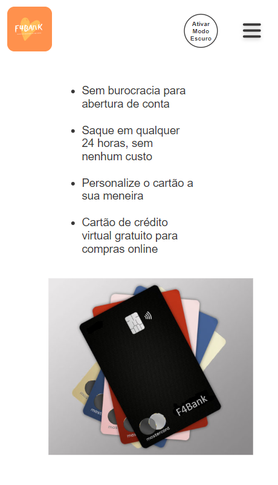
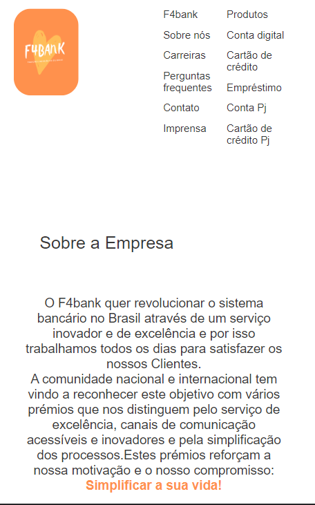
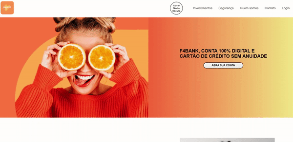

<h1 align="center">
    <br>
    <p align="center" style="color: #D30404; font-weight: bold;">🚀 Projeto Landing Page - F4Bank
<p>
</h1>

## 🚀 Resumo

A proposta foi de criar uma landing page sobre uma empresa fictícia. Escolhemos a F4bank que era um grande banco público brasileiro para competir com as startups que tem surgido, como Nubank, Banco Inter e Banco Neon, reforçando a segurança de um banco tradicional com décadas de história no país. 
 
<h1>
    <br>
    <p style="color: #D30404; font-weight: bold;">🎨 Layout</p>
</h1>

## Web

<p align="center" style="display: flex; align-items: flex-start; justify-content: center;">
     
     
<p align="center" style="display: flex; align-items: flex-start; justify-content: center;">
     
     
     


## Mobile - a

<p align="center">
     
     
     
     
</p>
</p>

### 🔧 Estrutura 

### Header:


No mobile escondemos o menu e acionamos um menu vertical através de um botão tipo "hamburger":


### Main: 

Dividimos a Main nas seguintes seções: Home, sobre nós, produtos, seguro de vida, seguro de carro e FAQ.
Em cada tipo de seguro, trouxemos uma breve descrição e um formulário para solicitação de orçamento.

### Footer:


Dividimos o footer em 3 seções: Colaboradores, links do site e redes sociais.
Todos os links externos são funcionais e abrem em uma página em branco.


### Extra: 


Adicionado tema escuro acionado por botão no header.


<h1>
    <br>
    <p style="color: #D30404; font-weight: bold;">🔗 Link do projeto no Surge</p>
</h1>

 http://projetof4bank.surge.sh/


<h2>
    <br>
    <p style="color: #D30404; font-weight: bold;">🔗 Link do Kanban</p>
</h2>

https://trello.com/b/JnhQ4bMz/landing-page

<br>

## 🛠️ Construído com

<p>

<!-- git -->

<!-- html -->

<!-- css -->

<!-- javascript -->
</p>


<h1>
    <br>
    <p style="color: #D30404; font-weight: bold;">📁 Arquitetura</p>
</h1>

```
- 📁 F4Bank
 |- 📁 css
 |  - 📑 arquivos css
 |  
 |- 📁 img
 |  - 📑 imagens utilizadas
 |  - 📁 social
 |      - 📑 mídias sociais
 |      
 |- 📁 js
 |  - 📑 script.js
 |
 |- 📑 index.html
 |- 📑 login.html
 |- 📑 README.md
```
<h1>
    <br>
    <p style="color: #D30404; font-weight: bold;">👨‍💻 Participantes</p>
</h1>

<table>
  <tr>
    <td align="center"><a href="https://github.com/gans92"><br /><sub><b>Gabriel Alisson</b></sub></a><br /></td>    
    <td align="center"><a href="https://github.com/SantiagoOliveira22"><br /><sub><b>Santiago Oliveira</b></sub></a><br /></td> 
      <td align="center"><a href="https://github.com/ju-marques"><br /><sub><b>Juliana Marques</b></sub></a><br /></td> 
  </tr>
  
</table>

<br>
